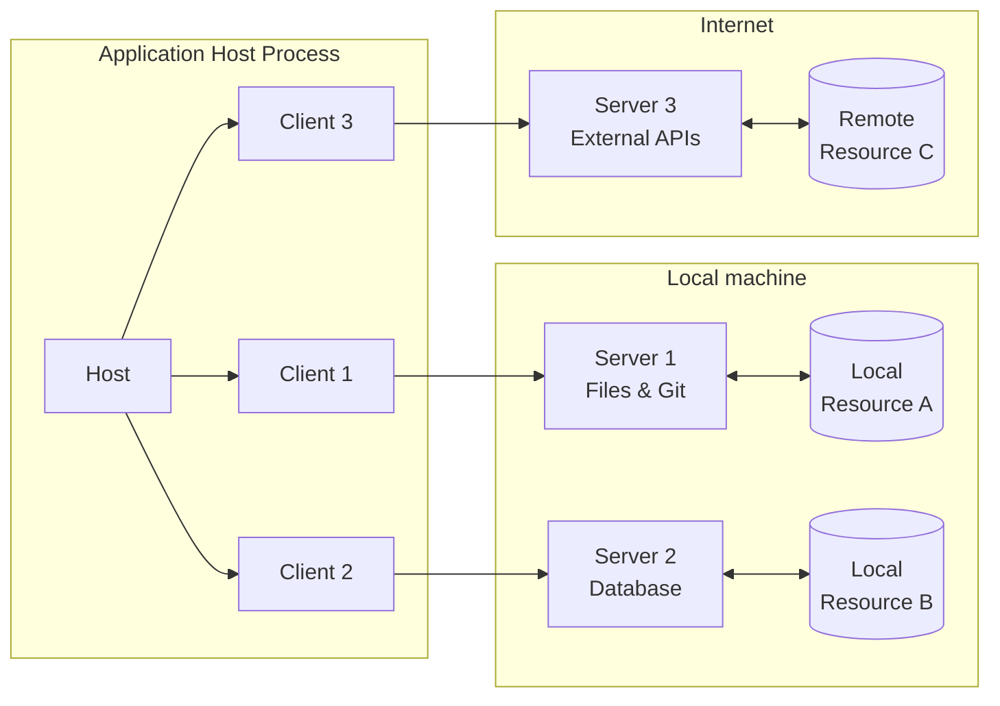
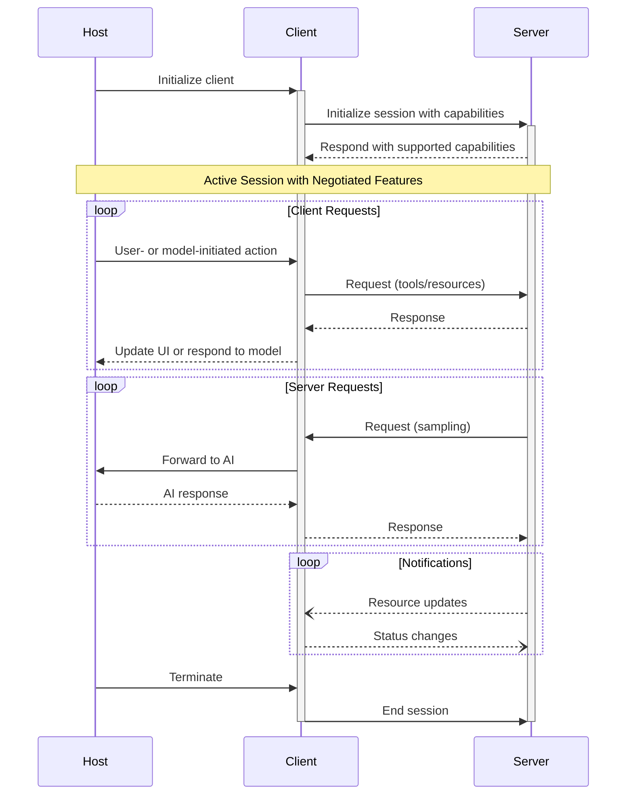
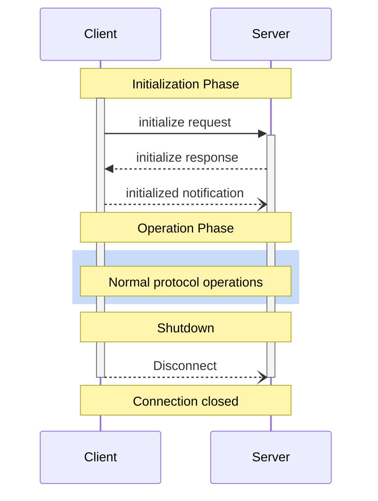
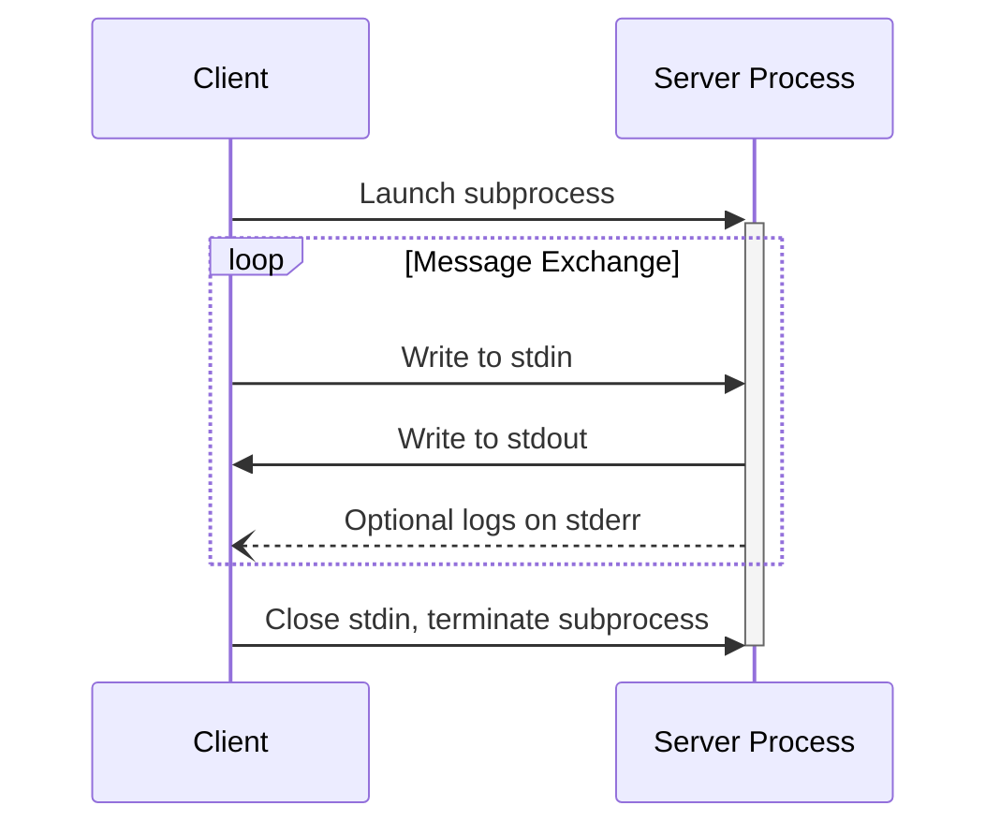
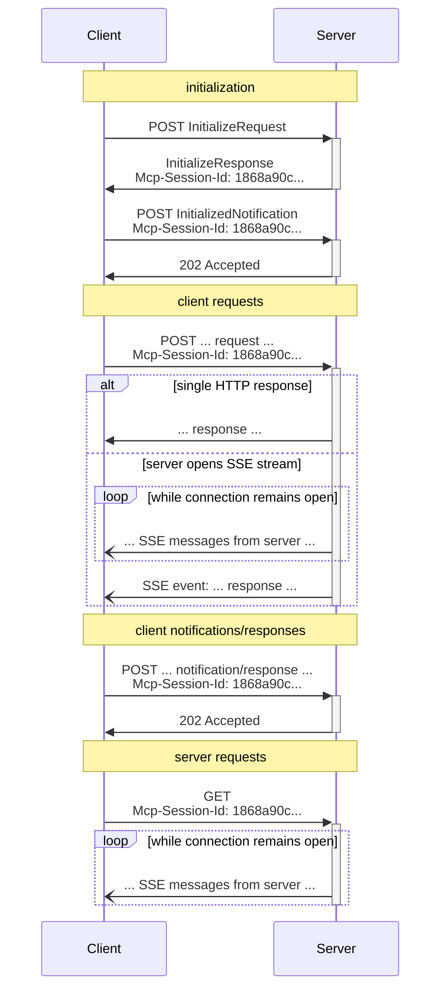
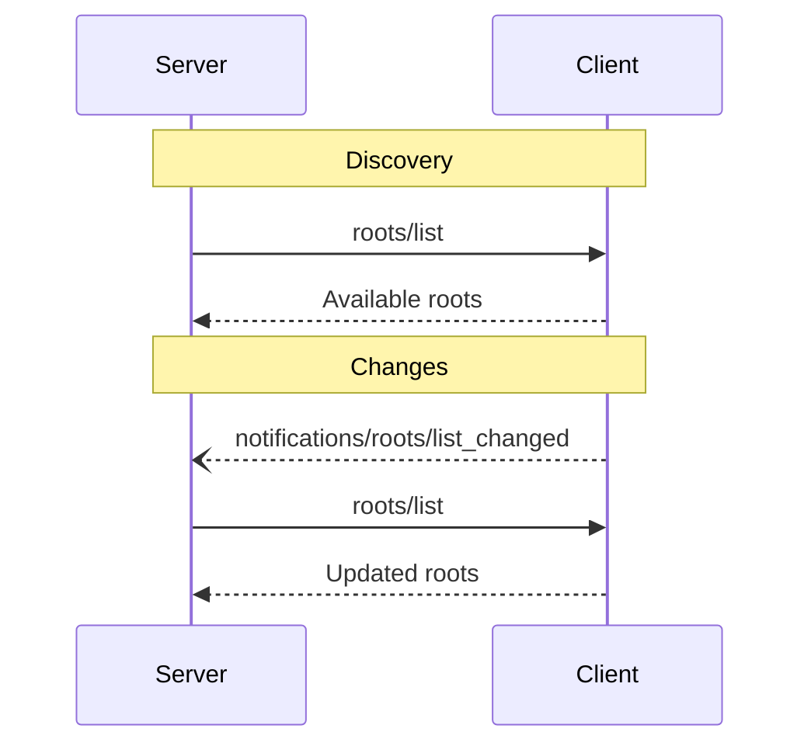
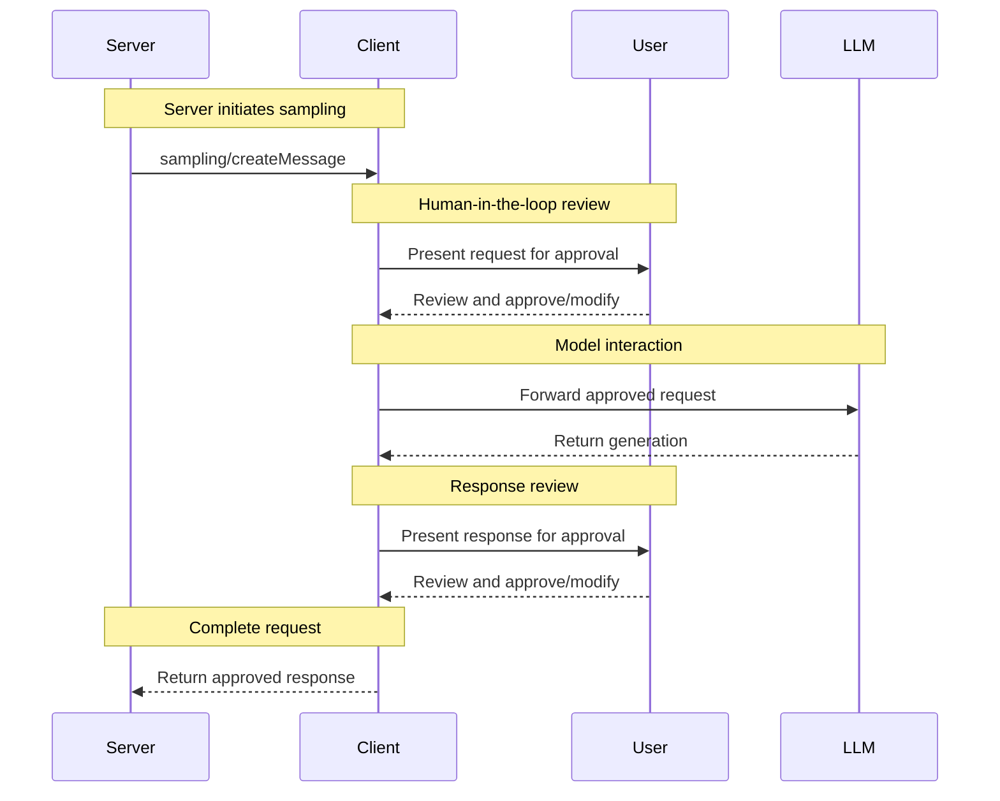
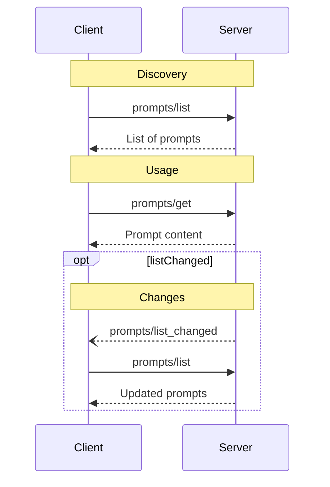
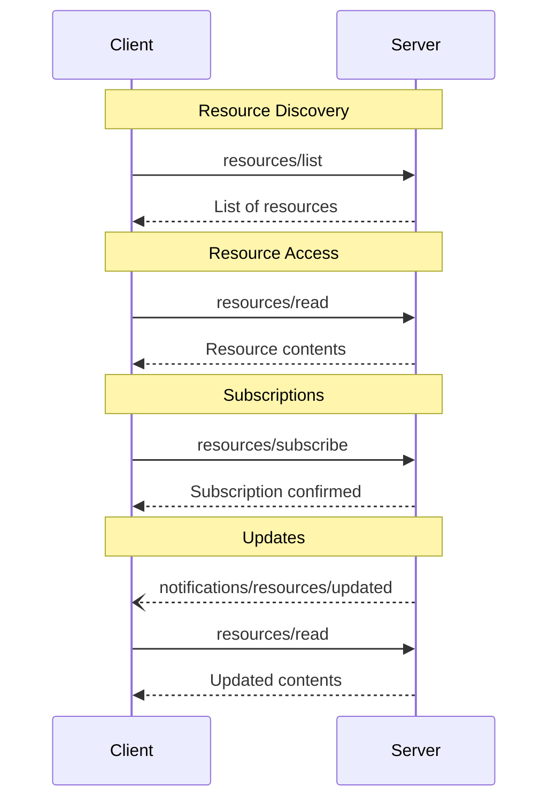
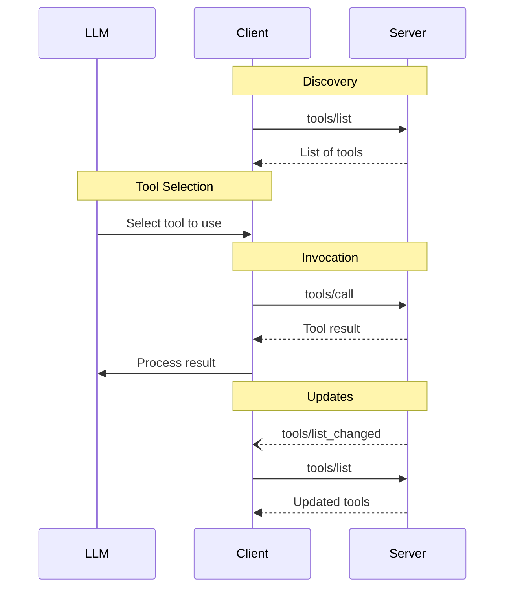

# Architecture

The Model Context Protocol (MCP) follows a client-host-server architecture where each
host can run multiple client instances. This architecture enables users to integrate AI
capabilities across applications while maintaining clear security boundaries and
isolating concerns. Built on JSON-RPC, MCP provides a stateful session protocol focused
on context exchange and sampling coordination between clients and servers.

## Core Components



### Host

The host process acts as the container and coordinator:

* Creates and manages multiple client instances
* Controls client connection permissions and lifecycle
* Enforces security policies and consent requirements
* Handles user authorization decisions
* Coordinates AI/LLM integration and sampling
* Manages context aggregation across clients

### Clients

Each client is created by the host and maintains an isolated server connection:

* Establishes one stateful session per server
* Handles protocol negotiation and capability exchange
* Routes protocol messages bidirectionally
* Manages subscriptions and notifications
* Maintains security boundaries between servers

A host application creates and manages multiple clients, with each client having a 1:1
relationship with a particular server.

### Servers

Servers provide specialized context and capabilities:

* Expose resources, tools and prompts via MCP primitives
* Operate independently with focused responsibilities
* Request sampling through client interfaces
* Must respect security constraints
* Can be local processes or remote services

## Design Principles

MCP is built on several key design principles that inform its architecture and
implementation:

1. **Servers should be extremely easy to build**
   * Host applications handle complex orchestration responsibilities
   * Servers focus on specific, well-defined capabilities
   * Simple interfaces minimize implementation overhead
   * Clear separation enables maintainable code

2. **Servers should be highly composable**
   * Each server provides focused functionality in isolation
   * Multiple servers can be combined seamlessly
   * Shared protocol enables interoperability
   * Modular design supports extensibility

3. **Servers should not be able to read the whole conversation, nor "see into" other
   servers**
   * Servers receive only necessary contextual information
   * Full conversation history stays with the host
   * Each server connection maintains isolation
   * Cross-server interactions are controlled by the host
   * Host process enforces security boundaries

4. **Features can be added to servers and clients progressively**
   * Core protocol provides minimal required functionality
   * Additional capabilities can be negotiated as needed
   * Servers and clients evolve independently
   * Protocol designed for future extensibility
   * Backwards compatibility is maintained

## Capability Negotiation

The Model Context Protocol uses a capability-based negotiation system where clients and
servers explicitly declare their supported features during initialization. Capabilities
determine which protocol features and primitives are available during a session.

* Servers declare capabilities like resource subscriptions, tool support, and prompt
  templates
* Clients declare capabilities like sampling support and notification handling
* Both parties must respect declared capabilities throughout the session
* Additional capabilities can be negotiated through extensions to the protocol



Each capability unlocks specific protocol features for use during the session. For
example:

* Implemented [server features](/specification/2025-03-26/server) must be advertised in the
  server's capabilities
* Emitting resource subscription notifications requires the server to declare
  subscription support
* Tool invocation requires the server to declare tool capabilities
* [Sampling](/specification/2025-03-26/client) requires the client to declare support in its
  capabilities

This capability negotiation ensures clients and servers have a clear understanding of
supported functionality while maintaining protocol extensibility.


# Overview

<Info>**Protocol Revision**: 2025-03-26</Info>

The Model Context Protocol consists of several key components that work together:

* **Base Protocol**: Core JSON-RPC message types
* **Lifecycle Management**: Connection initialization, capability negotiation, and
  session control
* **Server Features**: Resources, prompts, and tools exposed by servers
* **Client Features**: Sampling and root directory lists provided by clients
* **Utilities**: Cross-cutting concerns like logging and argument completion

All implementations **MUST** support the base protocol and lifecycle management
components. Other components **MAY** be implemented based on the specific needs of the
application.

These protocol layers establish clear separation of concerns while enabling rich
interactions between clients and servers. The modular design allows implementations to
support exactly the features they need.

## Messages

All messages between MCP clients and servers **MUST** follow the
[JSON-RPC 2.0](https://www.jsonrpc.org/specification) specification. The protocol defines
these types of messages:

### Requests

Requests are sent from the client to the server or vice versa, to initiate an operation.

```typescript  theme={null}
{
  jsonrpc: "2.0";
  id: string | number;
  method: string;
  params?: {
    [key: string]: unknown;
  };
}
```

* Requests **MUST** include a string or integer ID.
* Unlike base JSON-RPC, the ID **MUST NOT** be `null`.
* The request ID **MUST NOT** have been previously used by the requestor within the same
  session.

### Responses

Responses are sent in reply to requests, containing the result or error of the operation.

```typescript  theme={null}
{
  jsonrpc: "2.0";
  id: string | number;
  result?: {
    [key: string]: unknown;
  }
  error?: {
    code: number;
    message: string;
    data?: unknown;
  }
}
```

* Responses **MUST** include the same ID as the request they correspond to.
* **Responses** are further sub-categorized as either **successful results** or
  **errors**. Either a `result` or an `error` **MUST** be set. A response **MUST NOT**
  set both.
* Results **MAY** follow any JSON object structure, while errors **MUST** include an
  error code and message at minimum.
* Error codes **MUST** be integers.

### Notifications

Notifications are sent from the client to the server or vice versa, as a one-way message.
The receiver **MUST NOT** send a response.

```typescript  theme={null}
{
  jsonrpc: "2.0";
  method: string;
  params?: {
    [key: string]: unknown;
  };
}
```

* Notifications **MUST NOT** include an ID.

### Batching

JSON-RPC also defines a means to
[batch multiple requests and notifications](https://www.jsonrpc.org/specification#batch),
by sending them in an array. MCP implementations **MAY** support sending JSON-RPC
batches, but **MUST** support receiving JSON-RPC batches.

## Auth

MCP provides an [Authorization](/specification/2025-03-26/basic/authorization) framework for use with HTTP.
Implementations using an HTTP-based transport **SHOULD** conform to this specification,
whereas implementations using STDIO transport **SHOULD NOT** follow this specification,
and instead retrieve credentials from the environment.

Additionally, clients and servers **MAY** negotiate their own custom authentication and
authorization strategies.

For further discussions and contributions to the evolution of MCP’s auth mechanisms, join
us in
[GitHub Discussions](https://github.com/modelcontextprotocol/specification/discussions)
to help shape the future of the protocol!

## Schema

The full specification of the protocol is defined as a
[TypeScript schema](https://github.com/modelcontextprotocol/specification/blob/main/schema/2025-03-26/schema.ts).
This is the source of truth for all protocol messages and structures.

There is also a
[JSON Schema](https://github.com/modelcontextprotocol/specification/blob/main/schema/2025-03-26/schema.json),
which is automatically generated from the TypeScript source of truth, for use with
various automated tooling.


# Lifecycle

<Info>**Protocol Revision**: 2025-03-26</Info>

The Model Context Protocol (MCP) defines a rigorous lifecycle for client-server
connections that ensures proper capability negotiation and state management.

1. **Initialization**: Capability negotiation and protocol version agreement
2. **Operation**: Normal protocol communication
3. **Shutdown**: Graceful termination of the connection



## Lifecycle Phases

### Initialization

The initialization phase **MUST** be the first interaction between client and server.
During this phase, the client and server:

* Establish protocol version compatibility
* Exchange and negotiate capabilities
* Share implementation details

The client **MUST** initiate this phase by sending an `initialize` request containing:

* Protocol version supported
* Client capabilities
* Client implementation information

```json  theme={null}
{
  "jsonrpc": "2.0",
  "id": 1,
  "method": "initialize",
  "params": {
    "protocolVersion": "2025-03-26",
    "capabilities": {
      "roots": {
        "listChanged": true
      },
      "sampling": {}
    },
    "clientInfo": {
      "name": "ExampleClient",
      "version": "1.0.0"
    }
  }
}
```

The initialize request **MUST NOT** be part of a JSON-RPC
[batch](https://www.jsonrpc.org/specification#batch), as other requests and notifications
are not possible until initialization has completed. This also permits backwards
compatibility with prior protocol versions that do not explicitly support JSON-RPC
batches.

The server **MUST** respond with its own capabilities and information:

```json  theme={null}
{
  "jsonrpc": "2.0",
  "id": 1,
  "result": {
    "protocolVersion": "2025-03-26",
    "capabilities": {
      "logging": {},
      "prompts": {
        "listChanged": true
      },
      "resources": {
        "subscribe": true,
        "listChanged": true
      },
      "tools": {
        "listChanged": true
      }
    },
    "serverInfo": {
      "name": "ExampleServer",
      "version": "1.0.0"
    },
    "instructions": "Optional instructions for the client"
  }
}
```

After successful initialization, the client **MUST** send an `initialized` notification
to indicate it is ready to begin normal operations:

```json  theme={null}
{
  "jsonrpc": "2.0",
  "method": "notifications/initialized"
}
```

* The client **SHOULD NOT** send requests other than
  [pings](/specification/2025-03-26/basic/utilities/ping) before the server has responded to the
  `initialize` request.
* The server **SHOULD NOT** send requests other than
  [pings](/specification/2025-03-26/basic/utilities/ping) and
  [logging](/specification/2025-03-26/server/utilities/logging) before receiving the `initialized`
  notification.

#### Version Negotiation

In the `initialize` request, the client **MUST** send a protocol version it supports.
This **SHOULD** be the *latest* version supported by the client.

If the server supports the requested protocol version, it **MUST** respond with the same
version. Otherwise, the server **MUST** respond with another protocol version it
supports. This **SHOULD** be the *latest* version supported by the server.

If the client does not support the version in the server's response, it **SHOULD**
disconnect.

#### Capability Negotiation

Client and server capabilities establish which optional protocol features will be
available during the session.

Key capabilities include:

| Category | Capability     | Description                                                                               |
| -------- | -------------- | ----------------------------------------------------------------------------------------- |
| Client   | `roots`        | Ability to provide filesystem [roots](/specification/2025-03-26/client/roots)             |
| Client   | `sampling`     | Support for LLM [sampling](/specification/2025-03-26/client/sampling) requests            |
| Client   | `experimental` | Describes support for non-standard experimental features                                  |
| Server   | `prompts`      | Offers [prompt templates](/specification/2025-03-26/server/prompts)                       |
| Server   | `resources`    | Provides readable [resources](/specification/2025-03-26/server/resources)                 |
| Server   | `tools`        | Exposes callable [tools](/specification/2025-03-26/server/tools)                          |
| Server   | `logging`      | Emits structured [log messages](/specification/2025-03-26/server/utilities/logging)       |
| Server   | `completions`  | Supports argument [autocompletion](/specification/2025-03-26/server/utilities/completion) |
| Server   | `experimental` | Describes support for non-standard experimental features                                  |

Capability objects can describe sub-capabilities like:

* `listChanged`: Support for list change notifications (for prompts, resources, and
  tools)
* `subscribe`: Support for subscribing to individual items' changes (resources only)

### Operation

During the operation phase, the client and server exchange messages according to the
negotiated capabilities.

Both parties **SHOULD**:

* Respect the negotiated protocol version
* Only use capabilities that were successfully negotiated

### Shutdown

During the shutdown phase, one side (usually the client) cleanly terminates the protocol
connection. No specific shutdown messages are defined—instead, the underlying transport
mechanism should be used to signal connection termination:

#### stdio

For the stdio [transport](/specification/2025-03-26/basic/transports), the client **SHOULD** initiate
shutdown by:

1. First, closing the input stream to the child process (the server)
2. Waiting for the server to exit, or sending `SIGTERM` if the server does not exit
   within a reasonable time
3. Sending `SIGKILL` if the server does not exit within a reasonable time after `SIGTERM`

The server **MAY** initiate shutdown by closing its output stream to the client and
exiting.

#### HTTP

For HTTP [transports](/specification/2025-03-26/basic/transports), shutdown is indicated by closing the
associated HTTP connection(s).

## Timeouts

Implementations **SHOULD** establish timeouts for all sent requests, to prevent hung
connections and resource exhaustion. When the request has not received a success or error
response within the timeout period, the sender **SHOULD** issue a [cancellation
notification](/specification/2025-03-26/basic/utilities/cancellation) for that request and stop waiting for
a response.

SDKs and other middleware **SHOULD** allow these timeouts to be configured on a
per-request basis.

Implementations **MAY** choose to reset the timeout clock when receiving a [progress
notification](/specification/2025-03-26/basic/utilities/progress) corresponding to the request, as this
implies that work is actually happening. However, implementations **SHOULD** always
enforce a maximum timeout, regardless of progress notifications, to limit the impact of a
misbehaving client or server.

## Error Handling

Implementations **SHOULD** be prepared to handle these error cases:

* Protocol version mismatch
* Failure to negotiate required capabilities
* Request [timeouts](#timeouts)

Example initialization error:

```json  theme={null}
{
  "jsonrpc": "2.0",
  "id": 1,
  "error": {
    "code": -32602,
    "message": "Unsupported protocol version",
    "data": {
      "supported": ["2024-11-05"],
      "requested": "1.0.0"
    }
  }
}
```
# Transports

<Info>**Protocol Revision**: 2025-03-26</Info>

MCP uses JSON-RPC to encode messages. JSON-RPC messages **MUST** be UTF-8 encoded.

The protocol currently defines two standard transport mechanisms for client-server
communication:

1. [stdio](#stdio), communication over standard in and standard out
2. [Streamable HTTP](#streamable-http)

Clients **SHOULD** support stdio whenever possible.

It is also possible for clients and servers to implement
[custom transports](#custom-transports) in a pluggable fashion.

## stdio

In the **stdio** transport:

* The client launches the MCP server as a subprocess.
* The server reads JSON-RPC messages from its standard input (`stdin`) and sends messages
  to its standard output (`stdout`).
* Messages may be JSON-RPC requests, notifications, responses—or a JSON-RPC
  [batch](https://www.jsonrpc.org/specification#batch) containing one or more requests
  and/or notifications.
* Messages are delimited by newlines, and **MUST NOT** contain embedded newlines.
* The server **MAY** write UTF-8 strings to its standard error (`stderr`) for logging
  purposes. Clients **MAY** capture, forward, or ignore this logging.
* The server **MUST NOT** write anything to its `stdout` that is not a valid MCP message.
* The client **MUST NOT** write anything to the server's `stdin` that is not a valid MCP
  message.



## Streamable HTTP

<Info>
  This replaces the [HTTP+SSE
  transport](/specification/2024-11-05/basic/transports#http-with-sse) from
  protocol version 2024-11-05. See the [backwards compatibility](#backwards-compatibility)
  guide below.
</Info>

In the **Streamable HTTP** transport, the server operates as an independent process that
can handle multiple client connections. This transport uses HTTP POST and GET requests.
Server can optionally make use of
[Server-Sent Events](https://en.wikipedia.org/wiki/Server-sent_events) (SSE) to stream
multiple server messages. This permits basic MCP servers, as well as more feature-rich
servers supporting streaming and server-to-client notifications and requests.

The server **MUST** provide a single HTTP endpoint path (hereafter referred to as the
**MCP endpoint**) that supports both POST and GET methods. For example, this could be a
URL like `https://example.com/mcp`.

#### Security Warning

When implementing Streamable HTTP transport:

1. Servers **MUST** validate the `Origin` header on all incoming connections to prevent DNS rebinding attacks
2. When running locally, servers **SHOULD** bind only to localhost (127.0.0.1) rather than all network interfaces (0.0.0.0)
3. Servers **SHOULD** implement proper authentication for all connections

Without these protections, attackers could use DNS rebinding to interact with local MCP servers from remote websites.

### Sending Messages to the Server

Every JSON-RPC message sent from the client **MUST** be a new HTTP POST request to the
MCP endpoint.

1. The client **MUST** use HTTP POST to send JSON-RPC messages to the MCP endpoint.
2. The client **MUST** include an `Accept` header, listing both `application/json` and
   `text/event-stream` as supported content types.
3. The body of the POST request **MUST** be one of the following:
   * A single JSON-RPC *request*, *notification*, or *response*
   * An array [batching](https://www.jsonrpc.org/specification#batch) one or more
     *requests and/or notifications*
   * An array [batching](https://www.jsonrpc.org/specification#batch) one or more
     *responses*
4. If the input consists solely of (any number of) JSON-RPC *responses* or
   *notifications*:
   * If the server accepts the input, the server **MUST** return HTTP status code 202
     Accepted with no body.
   * If the server cannot accept the input, it **MUST** return an HTTP error status code
     (e.g., 400 Bad Request). The HTTP response body **MAY** comprise a JSON-RPC *error
     response* that has no `id`.
5. If the input contains any number of JSON-RPC *requests*, the server **MUST** either
   return `Content-Type: text/event-stream`, to initiate an SSE stream, or
   `Content-Type: application/json`, to return one JSON object. The client **MUST**
   support both these cases.
6. If the server initiates an SSE stream:
   * The SSE stream **SHOULD** eventually include one JSON-RPC *response* per each
     JSON-RPC *request* sent in the POST body. These *responses* **MAY** be
     [batched](https://www.jsonrpc.org/specification#batch).
   * The server **MAY** send JSON-RPC *requests* and *notifications* before sending a
     JSON-RPC *response*. These messages **SHOULD** relate to the originating client
     *request*. These *requests* and *notifications* **MAY** be
     [batched](https://www.jsonrpc.org/specification#batch).
   * The server **SHOULD NOT** close the SSE stream before sending a JSON-RPC *response*
     per each received JSON-RPC *request*, unless the [session](#session-management)
     expires.
   * After all JSON-RPC *responses* have been sent, the server **SHOULD** close the SSE
     stream.
   * Disconnection **MAY** occur at any time (e.g., due to network conditions).
     Therefore:
     * Disconnection **SHOULD NOT** be interpreted as the client cancelling its request.
     * To cancel, the client **SHOULD** explicitly send an MCP `CancelledNotification`.
     * To avoid message loss due to disconnection, the server **MAY** make the stream
       [resumable](#resumability-and-redelivery).

### Listening for Messages from the Server

1. The client **MAY** issue an HTTP GET to the MCP endpoint. This can be used to open an
   SSE stream, allowing the server to communicate to the client, without the client first
   sending data via HTTP POST.
2. The client **MUST** include an `Accept` header, listing `text/event-stream` as a
   supported content type.
3. The server **MUST** either return `Content-Type: text/event-stream` in response to
   this HTTP GET, or else return HTTP 405 Method Not Allowed, indicating that the server
   does not offer an SSE stream at this endpoint.
4. If the server initiates an SSE stream:
   * The server **MAY** send JSON-RPC *requests* and *notifications* on the stream. These
     *requests* and *notifications* **MAY** be
     [batched](https://www.jsonrpc.org/specification#batch).
   * These messages **SHOULD** be unrelated to any concurrently-running JSON-RPC
     *request* from the client.
   * The server **MUST NOT** send a JSON-RPC *response* on the stream **unless**
     [resuming](#resumability-and-redelivery) a stream associated with a previous client
     request.
   * The server **MAY** close the SSE stream at any time.
   * The client **MAY** close the SSE stream at any time.

### Multiple Connections

1. The client **MAY** remain connected to multiple SSE streams simultaneously.
2. The server **MUST** send each of its JSON-RPC messages on only one of the connected
   streams; that is, it **MUST NOT** broadcast the same message across multiple streams.
   * The risk of message loss **MAY** be mitigated by making the stream
     [resumable](#resumability-and-redelivery).

### Resumability and Redelivery

To support resuming broken connections, and redelivering messages that might otherwise be
lost:

1. Servers **MAY** attach an `id` field to their SSE events, as described in the
   [SSE standard](https://html.spec.whatwg.org/multipage/server-sent-events.html#event-stream-interpretation).
   * If present, the ID **MUST** be globally unique across all streams within that
     [session](#session-management)—or all streams with that specific client, if session
     management is not in use.
2. If the client wishes to resume after a broken connection, it **SHOULD** issue an HTTP
   GET to the MCP endpoint, and include the
   [`Last-Event-ID`](https://html.spec.whatwg.org/multipage/server-sent-events.html#the-last-event-id-header)
   header to indicate the last event ID it received.
   * The server **MAY** use this header to replay messages that would have been sent
     after the last event ID, *on the stream that was disconnected*, and to resume the
     stream from that point.
   * The server **MUST NOT** replay messages that would have been delivered on a
     different stream.

In other words, these event IDs should be assigned by servers on a *per-stream* basis, to
act as a cursor within that particular stream.

### Session Management

An MCP "session" consists of logically related interactions between a client and a
server, beginning with the [initialization phase](/specification/2025-03-26/basic/lifecycle). To support
servers which want to establish stateful sessions:

1. A server using the Streamable HTTP transport **MAY** assign a session ID at
   initialization time, by including it in an `Mcp-Session-Id` header on the HTTP
   response containing the `InitializeResult`.
   * The session ID **SHOULD** be globally unique and cryptographically secure (e.g., a
     securely generated UUID, a JWT, or a cryptographic hash).
   * The session ID **MUST** only contain visible ASCII characters (ranging from 0x21 to
     0x7E).
2. If an `Mcp-Session-Id` is returned by the server during initialization, clients using
   the Streamable HTTP transport **MUST** include it in the `Mcp-Session-Id` header on
   all of their subsequent HTTP requests.
   * Servers that require a session ID **SHOULD** respond to requests without an
     `Mcp-Session-Id` header (other than initialization) with HTTP 400 Bad Request.
3. The server **MAY** terminate the session at any time, after which it **MUST** respond
   to requests containing that session ID with HTTP 404 Not Found.
4. When a client receives HTTP 404 in response to a request containing an
   `Mcp-Session-Id`, it **MUST** start a new session by sending a new `InitializeRequest`
   without a session ID attached.
5. Clients that no longer need a particular session (e.g., because the user is leaving
   the client application) **SHOULD** send an HTTP DELETE to the MCP endpoint with the
   `Mcp-Session-Id` header, to explicitly terminate the session.
   * The server **MAY** respond to this request with HTTP 405 Method Not Allowed,
     indicating that the server does not allow clients to terminate sessions.

### Sequence Diagram



### Backwards Compatibility

Clients and servers can maintain backwards compatibility with the deprecated [HTTP+SSE
transport](/specification/2024-11-05/basic/transports#http-with-sse) (from
protocol version 2024-11-05) as follows:

**Servers** wanting to support older clients should:

* Continue to host both the SSE and POST endpoints of the old transport, alongside the
  new "MCP endpoint" defined for the Streamable HTTP transport.
  * It is also possible to combine the old POST endpoint and the new MCP endpoint, but
    this may introduce unneeded complexity.

**Clients** wanting to support older servers should:

1. Accept an MCP server URL from the user, which may point to either a server using the
   old transport or the new transport.
2. Attempt to POST an `InitializeRequest` to the server URL, with an `Accept` header as
   defined above:
   * If it succeeds, the client can assume this is a server supporting the new Streamable
     HTTP transport.
   * If it fails with an HTTP 4xx status code (e.g., 405 Method Not Allowed or 404 Not
     Found):
     * Issue a GET request to the server URL, expecting that this will open an SSE stream
       and return an `endpoint` event as the first event.
     * When the `endpoint` event arrives, the client can assume this is a server running
       the old HTTP+SSE transport, and should use that transport for all subsequent
       communication.

## Custom Transports

Clients and servers **MAY** implement additional custom transport mechanisms to suit
their specific needs. The protocol is transport-agnostic and can be implemented over any
communication channel that supports bidirectional message exchange.

Implementers who choose to support custom transports **MUST** ensure they preserve the
JSON-RPC message format and lifecycle requirements defined by MCP. Custom transports
**SHOULD** document their specific connection establishment and message exchange patterns
to aid interoperability.


# Roots

<Info>**Protocol Revision**: 2025-03-26</Info>

The Model Context Protocol (MCP) provides a standardized way for clients to expose
filesystem "roots" to servers. Roots define the boundaries of where servers can operate
within the filesystem, allowing them to understand which directories and files they have
access to. Servers can request the list of roots from supporting clients and receive
notifications when that list changes.

## User Interaction Model

Roots in MCP are typically exposed through workspace or project configuration interfaces.

For example, implementations could offer a workspace/project picker that allows users to
select directories and files the server should have access to. This can be combined with
automatic workspace detection from version control systems or project files.

However, implementations are free to expose roots through any interface pattern that
suits their needs—the protocol itself does not mandate any specific user
interaction model.

## Capabilities

Clients that support roots **MUST** declare the `roots` capability during
[initialization](/specification/2025-03-26/basic/lifecycle#initialization):

```json  theme={null}
{
  "capabilities": {
    "roots": {
      "listChanged": true
    }
  }
}
```

`listChanged` indicates whether the client will emit notifications when the list of roots
changes.

## Protocol Messages

### Listing Roots

To retrieve roots, servers send a `roots/list` request:

**Request:**

```json  theme={null}
{
  "jsonrpc": "2.0",
  "id": 1,
  "method": "roots/list"
}
```

**Response:**

```json  theme={null}
{
  "jsonrpc": "2.0",
  "id": 1,
  "result": {
    "roots": [
      {
        "uri": "file:///home/user/projects/myproject",
        "name": "My Project"
      }
    ]
  }
}
```

### Root List Changes

When roots change, clients that support `listChanged` **MUST** send a notification:

```json  theme={null}
{
  "jsonrpc": "2.0",
  "method": "notifications/roots/list_changed"
}
```

## Message Flow



## Data Types

### Root

A root definition includes:

* `uri`: Unique identifier for the root. This **MUST** be a `file://` URI in the current
  specification.
* `name`: Optional human-readable name for display purposes.

Example roots for different use cases:

#### Project Directory

```json  theme={null}
{
  "uri": "file:///home/user/projects/myproject",
  "name": "My Project"
}
```

#### Multiple Repositories

```json  theme={null}
[
  {
    "uri": "file:///home/user/repos/frontend",
    "name": "Frontend Repository"
  },
  {
    "uri": "file:///home/user/repos/backend",
    "name": "Backend Repository"
  }
]
```

## Error Handling

Clients **SHOULD** return standard JSON-RPC errors for common failure cases:

* Client does not support roots: `-32601` (Method not found)
* Internal errors: `-32603`

Example error:

```json  theme={null}
{
  "jsonrpc": "2.0",
  "id": 1,
  "error": {
    "code": -32601,
    "message": "Roots not supported",
    "data": {
      "reason": "Client does not have roots capability"
    }
  }
}
```

## Security Considerations

1. Clients **MUST**:
   * Only expose roots with appropriate permissions
   * Validate all root URIs to prevent path traversal
   * Implement proper access controls
   * Monitor root accessibility

2. Servers **SHOULD**:
   * Handle cases where roots become unavailable
   * Respect root boundaries during operations
   * Validate all paths against provided roots

## Implementation Guidelines

1. Clients **SHOULD**:
   * Prompt users for consent before exposing roots to servers
   * Provide clear user interfaces for root management
   * Validate root accessibility before exposing
   * Monitor for root changes

2. Servers **SHOULD**:
   * Check for roots capability before usage
   * Handle root list changes gracefully
   * Respect root boundaries in operations
   * Cache root information appropriately
# Sampling

<Info>**Protocol Revision**: 2025-03-26</Info>

The Model Context Protocol (MCP) provides a standardized way for servers to request LLM
sampling ("completions" or "generations") from language models via clients. This flow
allows clients to maintain control over model access, selection, and permissions while
enabling servers to leverage AI capabilities—with no server API keys necessary.
Servers can request text, audio, or image-based interactions and optionally include
context from MCP servers in their prompts.

## User Interaction Model

Sampling in MCP allows servers to implement agentic behaviors, by enabling LLM calls to
occur *nested* inside other MCP server features.

Implementations are free to expose sampling through any interface pattern that suits
their needs—the protocol itself does not mandate any specific user interaction
model.

<Warning>
  For trust & safety and security, there **SHOULD** always
  be a human in the loop with the ability to deny sampling requests.

  Applications **SHOULD**:

  * Provide UI that makes it easy and intuitive to review sampling requests
  * Allow users to view and edit prompts before sending
  * Present generated responses for review before delivery
</Warning>

## Capabilities

Clients that support sampling **MUST** declare the `sampling` capability during
[initialization](/specification/2025-03-26/basic/lifecycle#initialization):

```json  theme={null}
{
  "capabilities": {
    "sampling": {}
  }
}
```

## Protocol Messages

### Creating Messages

To request a language model generation, servers send a `sampling/createMessage` request:

**Request:**

```json  theme={null}
{
  "jsonrpc": "2.0",
  "id": 1,
  "method": "sampling/createMessage",
  "params": {
    "messages": [
      {
        "role": "user",
        "content": {
          "type": "text",
          "text": "What is the capital of France?"
        }
      }
    ],
    "modelPreferences": {
      "hints": [
        {
          "name": "claude-3-sonnet"
        }
      ],
      "intelligencePriority": 0.8,
      "speedPriority": 0.5
    },
    "systemPrompt": "You are a helpful assistant.",
    "maxTokens": 100
  }
}
```

**Response:**

```json  theme={null}
{
  "jsonrpc": "2.0",
  "id": 1,
  "result": {
    "role": "assistant",
    "content": {
      "type": "text",
      "text": "The capital of France is Paris."
    },
    "model": "claude-3-sonnet-20240307",
    "stopReason": "endTurn"
  }
}
```

## Message Flow



## Data Types

### Messages

Sampling messages can contain:

#### Text Content

```json  theme={null}
{
  "type": "text",
  "text": "The message content"
}
```

#### Image Content

```json  theme={null}
{
  "type": "image",
  "data": "base64-encoded-image-data",
  "mimeType": "image/jpeg"
}
```

#### Audio Content

```json  theme={null}
{
  "type": "audio",
  "data": "base64-encoded-audio-data",
  "mimeType": "audio/wav"
}
```

### Model Preferences

Model selection in MCP requires careful abstraction since servers and clients may use
different AI providers with distinct model offerings. A server cannot simply request a
specific model by name since the client may not have access to that exact model or may
prefer to use a different provider's equivalent model.

To solve this, MCP implements a preference system that combines abstract capability
priorities with optional model hints:

#### Capability Priorities

Servers express their needs through three normalized priority values (0-1):

* `costPriority`: How important is minimizing costs? Higher values prefer cheaper models.
* `speedPriority`: How important is low latency? Higher values prefer faster models.
* `intelligencePriority`: How important are advanced capabilities? Higher values prefer
  more capable models.

#### Model Hints

While priorities help select models based on characteristics, `hints` allow servers to
suggest specific models or model families:

* Hints are treated as substrings that can match model names flexibly
* Multiple hints are evaluated in order of preference
* Clients **MAY** map hints to equivalent models from different providers
* Hints are advisory—clients make final model selection

For example:

```json  theme={null}
{
  "hints": [
    { "name": "claude-3-sonnet" }, // Prefer Sonnet-class models
    { "name": "claude" } // Fall back to any Claude model
  ],
  "costPriority": 0.3, // Cost is less important
  "speedPriority": 0.8, // Speed is very important
  "intelligencePriority": 0.5 // Moderate capability needs
}
```

The client processes these preferences to select an appropriate model from its available
options. For instance, if the client doesn't have access to Claude models but has Gemini,
it might map the sonnet hint to `gemini-1.5-pro` based on similar capabilities.

## Error Handling

Clients **SHOULD** return errors for common failure cases:

Example error:

```json  theme={null}
{
  "jsonrpc": "2.0",
  "id": 1,
  "error": {
    "code": -1,
    "message": "User rejected sampling request"
  }
}
```

## Security Considerations

1. Clients **SHOULD** implement user approval controls
2. Both parties **SHOULD** validate message content
3. Clients **SHOULD** respect model preference hints
4. Clients **SHOULD** implement rate limiting
5. Both parties **MUST** handle sensitive data appropriately

# Prompts

<Info>**Protocol Revision**: 2025-03-26</Info>

The Model Context Protocol (MCP) provides a standardized way for servers to expose prompt
templates to clients. Prompts allow servers to provide structured messages and
instructions for interacting with language models. Clients can discover available
prompts, retrieve their contents, and provide arguments to customize them.

## User Interaction Model

Prompts are designed to be **user-controlled**, meaning they are exposed from servers to
clients with the intention of the user being able to explicitly select them for use.

Typically, prompts would be triggered through user-initiated commands in the user
interface, which allows users to naturally discover and invoke available prompts.

For example, as slash commands:


However, implementors are free to expose prompts through any interface pattern that suits
their needs—the protocol itself does not mandate any specific user interaction
model.

## Capabilities

Servers that support prompts **MUST** declare the `prompts` capability during
[initialization](/specification/2025-03-26/basic/lifecycle#initialization):

```json  theme={null}
{
  "capabilities": {
    "prompts": {
      "listChanged": true
    }
  }
}
```

`listChanged` indicates whether the server will emit notifications when the list of
available prompts changes.

## Protocol Messages

### Listing Prompts

To retrieve available prompts, clients send a `prompts/list` request. This operation
supports [pagination](/specification/2025-03-26/server/utilities/pagination).

**Request:**

```json  theme={null}
{
  "jsonrpc": "2.0",
  "id": 1,
  "method": "prompts/list",
  "params": {
    "cursor": "optional-cursor-value"
  }
}
```

**Response:**

```json  theme={null}
{
  "jsonrpc": "2.0",
  "id": 1,
  "result": {
    "prompts": [
      {
        "name": "code_review",
        "description": "Asks the LLM to analyze code quality and suggest improvements",
        "arguments": [
          {
            "name": "code",
            "description": "The code to review",
            "required": true
          }
        ]
      }
    ],
    "nextCursor": "next-page-cursor"
  }
}
```

### Getting a Prompt

To retrieve a specific prompt, clients send a `prompts/get` request. Arguments may be
auto-completed through [the completion API](/specification/2025-03-26/server/utilities/completion).

**Request:**

```json  theme={null}
{
  "jsonrpc": "2.0",
  "id": 2,
  "method": "prompts/get",
  "params": {
    "name": "code_review",
    "arguments": {
      "code": "def hello():\n    print('world')"
    }
  }
}
```

**Response:**

```json  theme={null}
{
  "jsonrpc": "2.0",
  "id": 2,
  "result": {
    "description": "Code review prompt",
    "messages": [
      {
        "role": "user",
        "content": {
          "type": "text",
          "text": "Please review this Python code:\ndef hello():\n    print('world')"
        }
      }
    ]
  }
}
```

### List Changed Notification

When the list of available prompts changes, servers that declared the `listChanged`
capability **SHOULD** send a notification:

```json  theme={null}
{
  "jsonrpc": "2.0",
  "method": "notifications/prompts/list_changed"
}
```

## Message Flow



## Data Types

### Prompt

A prompt definition includes:

* `name`: Unique identifier for the prompt
* `description`: Optional human-readable description
* `arguments`: Optional list of arguments for customization

### PromptMessage

Messages in a prompt can contain:

* `role`: Either "user" or "assistant" to indicate the speaker
* `content`: One of the following content types:

#### Text Content

Text content represents plain text messages:

```json  theme={null}
{
  "type": "text",
  "text": "The text content of the message"
}
```

This is the most common content type used for natural language interactions.

#### Image Content

Image content allows including visual information in messages:

```json  theme={null}
{
  "type": "image",
  "data": "base64-encoded-image-data",
  "mimeType": "image/png"
}
```

The image data **MUST** be base64-encoded and include a valid MIME type. This enables
multi-modal interactions where visual context is important.

#### Audio Content

Audio content allows including audio information in messages:

```json  theme={null}
{
  "type": "audio",
  "data": "base64-encoded-audio-data",
  "mimeType": "audio/wav"
}
```

The audio data MUST be base64-encoded and include a valid MIME type. This enables
multi-modal interactions where audio context is important.

#### Embedded Resources

Embedded resources allow referencing server-side resources directly in messages:

```json  theme={null}
{
  "type": "resource",
  "resource": {
    "uri": "resource://example",
    "mimeType": "text/plain",
    "text": "Resource content"
  }
}
```

Resources can contain either text or binary (blob) data and **MUST** include:

* A valid resource URI
* The appropriate MIME type
* Either text content or base64-encoded blob data

Embedded resources enable prompts to seamlessly incorporate server-managed content like
documentation, code samples, or other reference materials directly into the conversation
flow.

## Error Handling

Servers **SHOULD** return standard JSON-RPC errors for common failure cases:

* Invalid prompt name: `-32602` (Invalid params)
* Missing required arguments: `-32602` (Invalid params)
* Internal errors: `-32603` (Internal error)

## Implementation Considerations

1. Servers **SHOULD** validate prompt arguments before processing
2. Clients **SHOULD** handle pagination for large prompt lists
3. Both parties **SHOULD** respect capability negotiation

## Security

Implementations **MUST** carefully validate all prompt inputs and outputs to prevent
injection attacks or unauthorized access to resources.


# Resources

<Info>**Protocol Revision**: 2025-03-26</Info>

The Model Context Protocol (MCP) provides a standardized way for servers to expose
resources to clients. Resources allow servers to share data that provides context to
language models, such as files, database schemas, or application-specific information.
Each resource is uniquely identified by a
[URI](https://datatracker.ietf.org/doc/html/rfc3986).

## User Interaction Model

Resources in MCP are designed to be **application-driven**, with host applications
determining how to incorporate context based on their needs.

For example, applications could:

* Expose resources through UI elements for explicit selection, in a tree or list view
* Allow the user to search through and filter available resources
* Implement automatic context inclusion, based on heuristics or the AI model's selection


However, implementations are free to expose resources through any interface pattern that
suits their needs—the protocol itself does not mandate any specific user
interaction model.

## Capabilities

Servers that support resources **MUST** declare the `resources` capability:

```json  theme={null}
{
  "capabilities": {
    "resources": {
      "subscribe": true,
      "listChanged": true
    }
  }
}
```

The capability supports two optional features:

* `subscribe`: whether the client can subscribe to be notified of changes to individual
  resources.
* `listChanged`: whether the server will emit notifications when the list of available
  resources changes.

Both `subscribe` and `listChanged` are optional—servers can support neither,
either, or both:

```json  theme={null}
{
  "capabilities": {
    "resources": {} // Neither feature supported
  }
}
```

```json  theme={null}
{
  "capabilities": {
    "resources": {
      "subscribe": true // Only subscriptions supported
    }
  }
}
```

```json  theme={null}
{
  "capabilities": {
    "resources": {
      "listChanged": true // Only list change notifications supported
    }
  }
}
```

## Protocol Messages

### Listing Resources

To discover available resources, clients send a `resources/list` request. This operation
supports [pagination](/specification/2025-03-26/server/utilities/pagination).

**Request:**

```json  theme={null}
{
  "jsonrpc": "2.0",
  "id": 1,
  "method": "resources/list",
  "params": {
    "cursor": "optional-cursor-value"
  }
}
```

**Response:**

```json  theme={null}
{
  "jsonrpc": "2.0",
  "id": 1,
  "result": {
    "resources": [
      {
        "uri": "file:///project/src/main.rs",
        "name": "main.rs",
        "description": "Primary application entry point",
        "mimeType": "text/x-rust"
      }
    ],
    "nextCursor": "next-page-cursor"
  }
}
```

### Reading Resources

To retrieve resource contents, clients send a `resources/read` request:

**Request:**

```json  theme={null}
{
  "jsonrpc": "2.0",
  "id": 2,
  "method": "resources/read",
  "params": {
    "uri": "file:///project/src/main.rs"
  }
}
```

**Response:**

```json  theme={null}
{
  "jsonrpc": "2.0",
  "id": 2,
  "result": {
    "contents": [
      {
        "uri": "file:///project/src/main.rs",
        "mimeType": "text/x-rust",
        "text": "fn main() {\n    println!(\"Hello world!\");\n}"
      }
    ]
  }
}
```

### Resource Templates

Resource templates allow servers to expose parameterized resources using
[URI templates](https://datatracker.ietf.org/doc/html/rfc6570). Arguments may be
auto-completed through [the completion API](/specification/2025-03-26/server/utilities/completion).

**Request:**

```json  theme={null}
{
  "jsonrpc": "2.0",
  "id": 3,
  "method": "resources/templates/list"
}
```

**Response:**

```json  theme={null}
{
  "jsonrpc": "2.0",
  "id": 3,
  "result": {
    "resourceTemplates": [
      {
        "uriTemplate": "file:///{path}",
        "name": "Project Files",
        "description": "Access files in the project directory",
        "mimeType": "application/octet-stream"
      }
    ]
  }
}
```

### List Changed Notification

When the list of available resources changes, servers that declared the `listChanged`
capability **SHOULD** send a notification:

```json  theme={null}
{
  "jsonrpc": "2.0",
  "method": "notifications/resources/list_changed"
}
```

### Subscriptions

The protocol supports optional subscriptions to resource changes. Clients can subscribe
to specific resources and receive notifications when they change:

**Subscribe Request:**

```json  theme={null}
{
  "jsonrpc": "2.0",
  "id": 4,
  "method": "resources/subscribe",
  "params": {
    "uri": "file:///project/src/main.rs"
  }
}
```

**Update Notification:**

```json  theme={null}
{
  "jsonrpc": "2.0",
  "method": "notifications/resources/updated",
  "params": {
    "uri": "file:///project/src/main.rs"
  }
}
```

## Message Flow



## Data Types

### Resource

A resource definition includes:

* `uri`: Unique identifier for the resource
* `name`: Human-readable name
* `description`: Optional description
* `mimeType`: Optional MIME type
* `size`: Optional size in bytes

### Resource Contents

Resources can contain either text or binary data:

#### Text Content

```json  theme={null}
{
  "uri": "file:///example.txt",
  "mimeType": "text/plain",
  "text": "Resource content"
}
```

#### Binary Content

```json  theme={null}
{
  "uri": "file:///example.png",
  "mimeType": "image/png",
  "blob": "base64-encoded-data"
}
```

## Common URI Schemes

The protocol defines several standard URI schemes. This list not
exhaustive—implementations are always free to use additional, custom URI schemes.

### https\://

Used to represent a resource available on the web.

Servers **SHOULD** use this scheme only when the client is able to fetch and load the
resource directly from the web on its own—that is, it doesn’t need to read the resource
via the MCP server.

For other use cases, servers **SHOULD** prefer to use another URI scheme, or define a
custom one, even if the server will itself be downloading resource contents over the
internet.

### file://

Used to identify resources that behave like a filesystem. However, the resources do not
need to map to an actual physical filesystem.

MCP servers **MAY** identify file:// resources with an
[XDG MIME type](https://specifications.freedesktop.org/shared-mime-info-spec/0.14/ar01s02.html#id-1.3.14),
like `inode/directory`, to represent non-regular files (such as directories) that don’t
otherwise have a standard MIME type.

### git://

Git version control integration.

## Error Handling

Servers **SHOULD** return standard JSON-RPC errors for common failure cases:

* Resource not found: `-32002`
* Internal errors: `-32603`

Example error:

```json  theme={null}
{
  "jsonrpc": "2.0",
  "id": 5,
  "error": {
    "code": -32002,
    "message": "Resource not found",
    "data": {
      "uri": "file:///nonexistent.txt"
    }
  }
}
```

## Security Considerations

1. Servers **MUST** validate all resource URIs
2. Access controls **SHOULD** be implemented for sensitive resources
3. Binary data **MUST** be properly encoded
4. Resource permissions **SHOULD** be checked before operations


# Tools

<Info>**Protocol Revision**: 2025-03-26</Info>

The Model Context Protocol (MCP) allows servers to expose tools that can be invoked by
language models. Tools enable models to interact with external systems, such as querying
databases, calling APIs, or performing computations. Each tool is uniquely identified by
a name and includes metadata describing its schema.

## User Interaction Model

Tools in MCP are designed to be **model-controlled**, meaning that the language model can
discover and invoke tools automatically based on its contextual understanding and the
user's prompts.

However, implementations are free to expose tools through any interface pattern that
suits their needs—the protocol itself does not mandate any specific user
interaction model.

<Warning>
  For trust & safety and security, there **SHOULD** always
  be a human in the loop with the ability to deny tool invocations.

  Applications **SHOULD**:

  * Provide UI that makes clear which tools are being exposed to the AI model
  * Insert clear visual indicators when tools are invoked
  * Present confirmation prompts to the user for operations, to ensure a human is in the
    loop
</Warning>

## Capabilities

Servers that support tools **MUST** declare the `tools` capability:

```json  theme={null}
{
  "capabilities": {
    "tools": {
      "listChanged": true
    }
  }
}
```

`listChanged` indicates whether the server will emit notifications when the list of
available tools changes.

## Protocol Messages

### Listing Tools

To discover available tools, clients send a `tools/list` request. This operation supports
[pagination](/specification/2025-03-26/server/utilities/pagination).

**Request:**

```json  theme={null}
{
  "jsonrpc": "2.0",
  "id": 1,
  "method": "tools/list",
  "params": {
    "cursor": "optional-cursor-value"
  }
}
```

**Response:**

```json  theme={null}
{
  "jsonrpc": "2.0",
  "id": 1,
  "result": {
    "tools": [
      {
        "name": "get_weather",
        "description": "Get current weather information for a location",
        "inputSchema": {
          "type": "object",
          "properties": {
            "location": {
              "type": "string",
              "description": "City name or zip code"
            }
          },
          "required": ["location"]
        }
      }
    ],
    "nextCursor": "next-page-cursor"
  }
}
```

### Calling Tools

To invoke a tool, clients send a `tools/call` request:

**Request:**

```json  theme={null}
{
  "jsonrpc": "2.0",
  "id": 2,
  "method": "tools/call",
  "params": {
    "name": "get_weather",
    "arguments": {
      "location": "New York"
    }
  }
}
```

**Response:**

```json  theme={null}
{
  "jsonrpc": "2.0",
  "id": 2,
  "result": {
    "content": [
      {
        "type": "text",
        "text": "Current weather in New York:\nTemperature: 72°F\nConditions: Partly cloudy"
      }
    ],
    "isError": false
  }
}
```

### List Changed Notification

When the list of available tools changes, servers that declared the `listChanged`
capability **SHOULD** send a notification:

```json  theme={null}
{
  "jsonrpc": "2.0",
  "method": "notifications/tools/list_changed"
}
```

## Message Flow



## Data Types

### Tool

A tool definition includes:

* `name`: Unique identifier for the tool
* `description`: Human-readable description of functionality
* `inputSchema`: JSON Schema defining expected parameters
* `annotations`: optional properties describing tool behavior

<Warning>
  For trust & safety and security, clients **MUST** consider
  tool annotations to be untrusted unless they come from trusted servers.
</Warning>

### Tool Result

Tool results can contain multiple content items of different types:

#### Text Content

```json  theme={null}
{
  "type": "text",
  "text": "Tool result text"
}
```

#### Image Content

```json  theme={null}
{
  "type": "image",
  "data": "base64-encoded-data",
  "mimeType": "image/png"
}
```

#### Audio Content

```json  theme={null}
{
  "type": "audio",
  "data": "base64-encoded-audio-data",
  "mimeType": "audio/wav"
}
```

#### Embedded Resources

[Resources](/specification/2025-03-26/server/resources) **MAY** be embedded, to provide additional context
or data, behind a URI that can be subscribed to or fetched again by the client later:

```json  theme={null}
{
  "type": "resource",
  "resource": {
    "uri": "resource://example",
    "mimeType": "text/plain",
    "text": "Resource content"
  }
}
```

## Error Handling

Tools use two error reporting mechanisms:

1. **Protocol Errors**: Standard JSON-RPC errors for issues like:
   * Unknown tools
   * Invalid arguments
   * Server errors

2. **Tool Execution Errors**: Reported in tool results with `isError: true`:
   * API failures
   * Invalid input data
   * Business logic errors

Example protocol error:

```json  theme={null}
{
  "jsonrpc": "2.0",
  "id": 3,
  "error": {
    "code": -32602,
    "message": "Unknown tool: invalid_tool_name"
  }
}
```

Example tool execution error:

```json  theme={null}
{
  "jsonrpc": "2.0",
  "id": 4,
  "result": {
    "content": [
      {
        "type": "text",
        "text": "Failed to fetch weather data: API rate limit exceeded"
      }
    ],
    "isError": true
  }
}
```

## Security Considerations

1. Servers **MUST**:
   * Validate all tool inputs
   * Implement proper access controls
   * Rate limit tool invocations
   * Sanitize tool outputs

2. Clients **SHOULD**:
   * Prompt for user confirmation on sensitive operations
   * Show tool inputs to the user before calling the server, to avoid malicious or
     accidental data exfiltration
   * Validate tool results before passing to LLM
   * Implement timeouts for tool calls
   * Log tool usage for audit purposes
